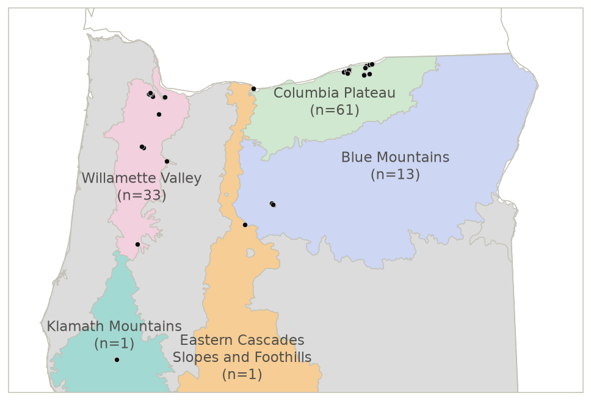
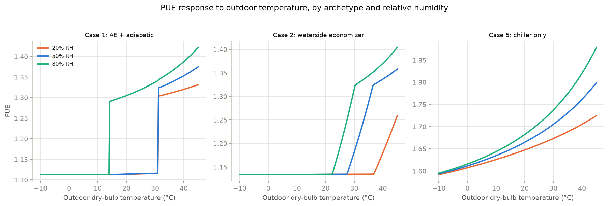
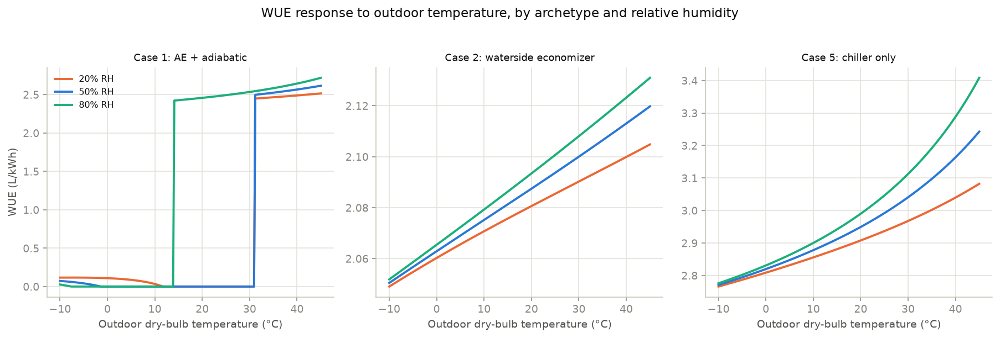

# Methods (draft): Heat Risk to Oregon Data Centers

## 1. Study Area and Data Sources

### 1.1 Study Area

This analysis covers 109 Oregon data center facilities identified in the IM3/PNNL Data Center Inventory, an open-source compilation of current U.S. data center locations. The inventory records present-day sites only; it does not distinguish planned or future facilities. Figure M0 shows the study area, with each facility plotted against the EPA Level III ecoregion boundaries used for the sub-regional analysis in §2.3.

*Figure M0. The 109-facility study area, with EPA Level III ecoregion boundaries underlaid (see §2.3).*

### 1.2 Data Sources

| Category | Dataset / Source | Key Specs | Used For |
|---|---|---|---|
| Data Center Exposure | IM3/PNNL Data Center Inventory | 109 Oregon facility locations, current sites only | Master list of facilities analyzed throughout (§2.1–2.3) |
| Heat Hazard | LOCA2 (temp; Pierce et al. 2014, 2023) + LOCA CMIP6 humidity companion (Pierce and Cayan 2015) | Statistically downscaled CMIP6 daily tasmax/tasmin, historical + future; humidity downscaled on LOCA2's own 1/16° grid, computed directly from LOCA2's own Tmax/Tmin | Temperature and humidity drivers for all heat analysis (§2.1–2.2) |
| Heat Vulnerability | ASHRAE TC9.9 | Data center equipment operating-temperature guideline | Acute-failure threshold (§2.1) |
| | Lei & Masanet (2020, 2022) PUE/WUE model | Hybrid physics/statistical model, 10 published DC archetypes, validated against real-world data | Chronic cooling-efficiency projection (§2.2) |
| Sub-region Boundaries | EPA Level III Ecoregions of Oregon (Omernik 1987) | 9 ecoregion polygons for Oregon | Groups facilities into sub-regions; selects one representative facility per region (§2.3) |
| Elevation | LOCA elevation field | Per-grid-cell elevation | Atmospheric pressure for the PUE/WUE model (§2.2) |

## 2. Methods

### Time Horizons and Climate Ensemble

This analysis uses three time periods. The **historical baseline**, 1985–2014, is the most recent 30-year normal available in LOCA2's historical CMIP6 experiment; projected changes are reported relative to this recent baseline rather than to a more distant reference period that would already include several decades of past warming. **Mid-century**, 2045–2074, is the primary analysis period, matched to the multi-decade mechanical and cooling lifespan of data center infrastructure. **End-of-century**, 2075–2100, provides a longer-horizon comparison, reflecting the longer planning and operating timescales of the power infrastructure that facilities depend on. The mid-century and end-of-century windows differ in length, 30 years versus 26 years, because both are matched to LOCA2's native downscaling file boundaries rather than to round decades.

All heat and PUE/WUE results use a **20-model ensemble** under **SSP3-7.0** — the LOCA2 models with SSP3-7.0 downscaled for both temperature and its humidity companion, 20 of 27 candidates, one realization per model. Ensemble uncertainty is reported as the mean plus the 5th–95th percentile range across models, matching OCA7's own convention.

### 2.1 Acute Heat Risk: Facility Operational Failure

This analysis computes two annual heat indices per facility, per GCM, and per period, at both the facility point and across the full grid. **Threshold-exceedance days** counts the days in a year where daily maximum temperature exceeds 35°C. **Cooling Degree Days (CDD)** sums, over the year, the amount by which the daily mean temperature, averaged from the day's maximum and minimum, exceeds a base temperature of 18.3°C. CDD is a cumulative thermal-load measure, not an equipment-failure threshold, and unlike threshold-exceedance days, it depends on daily minimum as well as maximum temperature.

The 35°C threshold is the Class A2 allowable-range upper bound published by ASHRAE Technical Committee 9.9 (2015), the operating limit most modern data center equipment is built to handle, applied uniformly across all facilities. Crossing the threshold does not mean physical equipment damage; it means cooling capacity can no longer keep pace with heat rejection, putting the facility at risk of a controlled or uncontrolled shutdown.

Both indices are period-level only. This analysis does not produce a monthly-resolved heat-index time series, in contrast to §2.2's PUE/WUE analysis, which is resolved to daily and monthly timescales.

### 2.2 Chronic Heat Risk: Cooling Load (PUE/WUE)

**The model.** This analysis estimates Power Usage Effectiveness and Water Usage Effectiveness using Lei and Masanet's open-source hybrid physics/statistical model (Lei and Masanet 2020, 2022). Power Usage Effectiveness, or PUE, is the ratio of a facility's total electricity use to the electricity used by its IT equipment alone. Water Usage Effectiveness, or WUE, is the onsite water used per unit of IT electricity. The same model underlies the climate- and technology-specific PUE/WUE estimates published in the 2024 LBNL Data Center Energy Usage Report (Shehabi et al. 2024); Lei and Masanet are co-authors of both.

The model takes three climate inputs: outdoor temperature, relative humidity, and atmospheric pressure calculated from each facility's elevation. It combines these with roughly 20 equipment parameters as technology inputs, including economizer and chiller thresholds, fan and pump efficiencies, and cooling-tower cycles of concentration, each held at the published midpoint value from Lei & Masanet's Table B.1. The water-cooled chiller's efficiency is represented by its coefficient of performance, the ratio of cooling delivered to the electricity it consumes. Lei & Masanet fit a statistical model to manufacturer chiller-performance data so that this efficiency varies with wet-bulb temperature and load fraction, the share of the chiller's full cooling capacity in use at a given time.

**Why both temperature and humidity matter.** Evaporative and economizer-based cooling — the energy-saving methods most large data centers use — work by exchanging heat with outdoor air directly (an airside or waterside economizer) or by evaporating water into it (adiabatic cooling / humidification), and both processes are governed by *wet-bulb* temperature, which mixes dry-bulb temperature and humidity together. A cooling system's response to a 30°C, 20%-RH day is very different from its response to a 30°C, 80%-RH day, even though the temperature is identical. This is why temperature and humidity are paired throughout: LOCA2 tasmax/tasmin with the LOCA CMIP6 humidity companion dataset, downscaled on LOCA2's own grid from LOCA2's own temperature fields.

**Three cooling archetypes.** Lei and Masanet (2022) publish ten cooling-system archetypes, each validated against real chiller-performance data. This analysis uses the three that both represent a distinct cooling technology and match a size class present in Oregon's facility population, large-scale or midsize. Case 1, a large-scale system with an airside economizer, adiabatic cooling, and a backup water-cooled chiller, is the same configuration Lei and Masanet (2020) validated against real reported quarterly PUE from 17 Google and Facebook data centers, including Google's The Dalles and Meta's Prineville facility, both within this analysis's own study area; most reported values fell within the model's 50% prediction interval and nearly all within its 90% interval. Case 2 is the same large-scale size class with a waterside economizer instead, a distinct free-cooling mechanism. Case 5 is a midsize system with a water-cooled chiller and no economizer, the no-free-cooling counterfactual.

| Case | Size class | Configuration | Direct evaporation | Space humidification | Cooling tower |
|---|---|---|---|---|---|
| 1 | Large-scale | Airside economizer + adiabatic cooling, water-cooled chiller supplemental | Yes | Adiabatic | Yes |
| 2 | Large-scale | Waterside economizer + water-cooled chiller | n/a | n/a | Yes |
| 5 | Midsize | Water-cooled chiller only, no economizer | n/a | Adiabatic | Yes |

The model's threshold and branch behavior, how each archetype's PUE and WUE respond across the full range of outdoor temperature and humidity, is illustrated in the Supplemental Material.

**Ensemble extension.** A full statewide grid run was attempted and found computationally infeasible; the ensemble instead runs at each of the 109 facility points, for all three archetypes, across all 20 GCMs and three periods.

Output: PUE and WUE per facility, per GCM, per archetype, per period (daily resolution, aggregated to period means and monthly climatologies) — the projected change in cooling electricity and water use as the region warms.

### 2.3 Sub-Regional Analysis: EPA Level III Ecoregions

Some results are reported by sub-region as well as statewide, using EPA Level III ecoregions (Omernik 1987), the same regionalization convention OCA7 uses for its own Oregon results. Of Oregon's nine Level III ecoregions, five contain at least one facility: 61 in the Columbia Plateau, 33 in the Willamette Valley, 13 in the Blue Mountains, and 1 each in the Eastern Cascades Slopes and Foothills and the Klamath Mountains/California High North Coast Range.

For PUE and WUE, each ecoregion is represented by one facility: the facility closest to that ecoregion's own facility-cluster centroid, computed in an equal-area projection, rather than an average across the region's facilities. This follows Lei & Masanet's own precedent of representing each of 15 U.S. climate zones with one representative city rather than an average of multiple stations. In the Blue Mountains, the representative facility is the region's coolest, lowest-PUE site: a spatial centroid does not guarantee a climatically typical facility.

For extreme heat, each ecoregion's indices are reported as the mean across every facility in that ecoregion, not a single representative site.

## 3. Assumptions and Limitations Log

| Analysis | Assumption or limitation | Detail |
|---|---|---|
| Extreme heat | Class A2 equipment assumed for all facilities | No facility-specific equipment-class data exists; a uniform, documented simplification. See §2.1. |
| General | One realization per GCM | Captures inter-model, structural uncertainty, not any single model's internal variability. |
| PUE/WUE | Facility-point, not full-grid | A full statewide grid was attempted and found computationally infeasible; stated plainly rather than silently narrowing scope. See §2.2. |
| PUE/WUE | Table B.1 midpoint equipment parameters for every facility | Not facility-specific specs, which are proprietary and unavailable. See §2.2. |
| PUE/WUE | GP-chiller-COP extrapolation beyond its manufacturer-data training range | The same due-diligence caveat Lei & Masanet's own paper carries, inherited here. |
| PUE/WUE | No independent validation against real Oregon facility-level PUE/WUE | No such public data exists at facility resolution for Oregon. This analysis relies on the source papers' own validation of the model itself: Lei & Masanet 2020's comparison against 17 real Google/Facebook data centers' reported quarterly PUE, and 2022's Latin-hypercube-sampled range check against real reported annual values. Not a re-validation specific to Oregon output. |
| PUE/WUE | Parameter uncertainty is not propagated | Equipment parameters are held at Table B.1 midpoints throughout, unlike the source papers' own Sobol/Latin-hypercube sampling across parameter ranges. The 5th–95th percentile ranges reported here reflect GCM-ensemble climate uncertainty only, not the combined parameter-and-climate uncertainty the source papers characterize. |
| PUE/WUE | One representative facility per ecoregion, not a spatial average | A deliberate choice to avoid bias from the model's threshold/branch structure, following Lei & Masanet's own representative-point convention. Carries its own caveat in the Blue Mountains, where the spatial centroid and outcome-metric centrality diverge. See §2.3. |
| General | No planned/future-facility distinction in the IM3/PNNL atlas used for this analysis | All facility counts and clusters described throughout refer to current, not projected-future, sites. |

## Supplemental Material

**What the model's response curve actually looks like.** Figure M1 and Figure M2 sweep outdoor temperature from −10°C to 45°C through each archetype's model, using the same implementation as the full 109-facility ensemble, at three fixed relative-humidity levels (20/50/80%, spanning Oregon's dry-high-desert-to-humid-valley range) and Table B.1 midpoint equipment parameters.

*Figure M1. PUE vs. outdoor dry-bulb temperature, by archetype and relative humidity. Sea-level pressure, Table B.1 midpoint parameters.*

*Figure M2. WUE vs. outdoor dry-bulb temperature, by archetype and relative humidity.*

These curves make the model's branch logic visible.

- **Case 1** shows a discrete decision structure. PUE and WUE step sharply upward at the low-temperature threshold, 14°C: below it, the economizer runs in full free-cooling mode with minimal water use. Between 14°C and the high-temperature threshold, 31°C, the system blends free cooling with active humidity control, where WUE rises sharply while PUE stays comparatively flat. Above 31°C the economizer can no longer meet the load alone, a supplemental water-cooled chiller engages, and both metrics rise smoothly with wet-bulb temperature.
- **Case 2**, the waterside economizer, shows a smoother, continuous ramp instead of a sharp step. Its economizer engages partially over a range of approach temperatures rather than switching on or off at a single threshold, producing an earlier, more gradual climb.
- **Case 5**, with no economizer, shows a smooth, monotonic curve across the full temperature range. The water-cooled chiller and cooling tower run continuously, and PUE/WUE track wet-bulb temperature through the chiller's own coefficient-of-performance curve.

This figure illustrates the model's mechanics, not a new empirical result. It fixes elevation at sea level and uses Table B.1 midpoint parameters rather than any specific facility's actual conditions, so absolute values will not match any single facility's modeled output.

## References

ASHRAE Technical Committee 9.9. 2015. Thermal Guidelines for Data Processing Environments, Table 2 (SI version).

Lei, N., and E. Masanet. 2020. Statistical analysis for predicting location-specific data center PUE and its improvement potential. Energy 197:117556. https://doi.org/10.1016/j.energy.2020.117556

Lei, N., and E. Masanet. 2022. Climate- and technology-specific PUE and WUE estimations for U.S. data centers using a hybrid statistical and thermodynamics-based approach. Resources, Conservation and Recycling 182:106323. https://doi.org/10.1016/j.resconrec.2022.106323

Omernik, J.M. 1987. Ecoregions of the conterminous United States. Annals of the Association of American Geographers 77(1):118–125. https://doi.org/10.1111/j.1467-8306.1987.tb00149.x

Pierce, D.W., D.R. Cayan, and B.L. Thrasher. 2014. Statistical downscaling using localized constructed analogs (LOCA). Journal of Hydrometeorology 15:2558–2585.

Pierce, D.W., and D.R. Cayan. 2015. Downscaling humidity with Localized Constructed Analogs (LOCA) over the conterminous United States. Climate Dynamics. https://doi.org/10.1007/s00382-015-2845-1

Pierce, D.W., D.R. Cayan, D.R. Feldman, and M.D. Risser. 2023. Future increases in North American extreme precipitation in CMIP6 downscaled with LOCA. Journal of Hydrometeorology. https://doi.org/10.1175/JHM-D-22-0194.1

Shehabi, A., et al. 2024. 2024 United States Data Center Energy Usage Report. Lawrence Berkeley National Laboratory.
