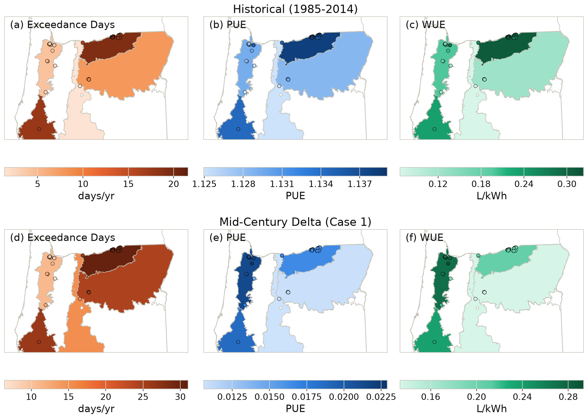
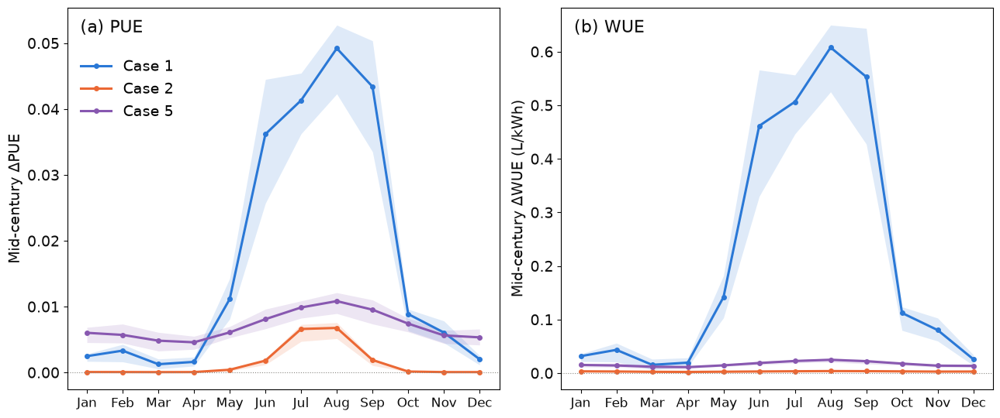
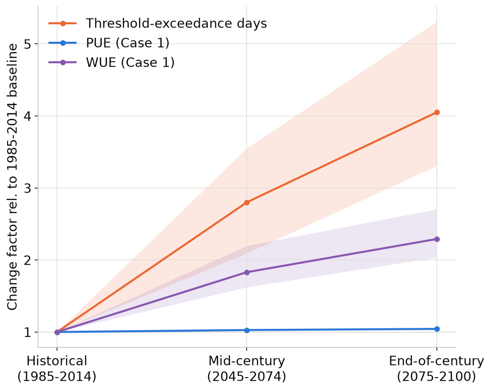
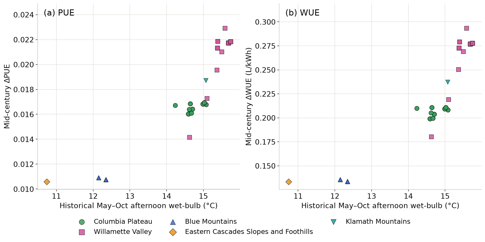

# Results: Heat Exposure and Cooling Efficiency at Oregon Data Centers

The 109 Oregon data centers identified in the facility inventory are concentrated in five of Oregon's nine Level III ecoregions (Omernik 1987): Columbia Plateau (61 facilities), Willamette Valley (33), Blue Mountains (13), Eastern Cascades Slopes and Foothills (1), and Klamath Mountains/California High North Coast Range (1). The inventory records current facility locations only and does not identify planned or future sites. The emphasis placed on Willamette Valley in the sections below reflects its standing as the second-largest current cluster and its projected trajectory, not an assumption about where future facilities will be built.

This analysis separates two kinds of heat risk, following the Introduction's hazard/vulnerability framing. Acute risk represents the physical hazard (daily maximum temperature) filtered through a single, uniform vulnerability parameter: the ASHRAE A2 operating limit, applied the same way to every facility regardless of its actual equipment or cooling design. Chronic risk represents a more detailed vulnerability model: a physics-based cooling-system simulation, run separately for each facility's actual conditions and for each of three cooling-system designs. The two therefore differ in more than which hazard they track. They differ in how much of each facility's real vulnerability is captured. The comparison between them is a comparison of two ways of representing that vulnerability, not a comparison of two hazards.

## Acute heat risk: extreme-heat days

Columbia Plateau is already the most heat-exposed region in the state by threshold-exceedance days: days on which daily maximum temperature exceeds 35°C, the ASHRAE A2 upper operating limit (historical baseline, 1985–2014; Figure 1, top). Its historical average of 19.2 exceedance days per year is roughly four to five times that of Willamette Valley (4.1) and more than double that of Blue Mountains (7.8). Eastern Cascades Slopes and Foothills, at 1.3 days per year, is the single mildest ecoregion by this measure, though it is represented by only one facility.

Facilities in Willamette Valley also show a wider ensemble spread in projected exceedance days than facilities in Columbia Plateau or Blue Mountains: a relative spread, the ensemble's 5th–95th percentile range divided by its mean, of 0.40, compared with 0.24 and 0.28 in those two regions. This pattern is consistent with Willamette Valley's low historical exceedance-day count sitting close to the threshold itself, where small differences among global climate models can shift the projected day count by a large fraction of a small baseline.

Statewide, threshold-exceedance days are projected to increase from a historical average of 13 days per year (5th–95th percentile across models: 12–15) to 37 (29–55) by mid-century and 53 (42–68) by end-of-century, a change factor of roughly 4.0 (Figure 3). The largest absolute increases are concentrated where exposure is already highest: Columbia Plateau gains an average of 30.4 exceedance days per year by mid-century, versus 24.5 in Blue Mountains and 10.9 in Willamette Valley (Figure 1, bottom). Acute risk therefore grows fastest where it is already highest.

*Figure 1. Historical values (top row) and mid-century absolute change (bottom row, Case 1) for threshold-exceedance days, PUE, and WUE. Ecoregions are shaded by the mean of their own facilities' values; points show every individual facility. Ecoregions with no data center facilities are shown in grey. PUE and WUE values shown here are annual means; the sections below report PUE and WUE on a May–October warm-season basis instead, once that seasonal concentration is established.*

## Chronic heat risk: cooling-system efficiency

Power Usage Effectiveness (PUE), the ratio of a data center's total electricity use to the electricity used by its computing equipment alone, and Water Usage Effectiveness (WUE), the equivalent measure for water, are both projected to rise as cooling becomes less efficient under warmer, more humid conditions.

The projected change in PUE and WUE is concentrated in a six-month period from May through October, with little change projected in the remaining months for systems that use an economizer (Figure 2). Cooling-system design affects both the size and the shape of this seasonal response. Large-scale systems combining an airside economizer with adiabatic cooling (Case 1) show the largest seasonal increase of the three cases evaluated (numbered per the source model's original ten-case typology, hence the non-consecutive numbering), reaching a projected mid-century August PUE increase of 0.05 and a WUE increase of approximately 0.6 liters per kilowatt-hour. Midsize systems without an economizer (Case 5) show a smaller peak, also in August, in both metrics, but their change is spread across the whole year rather than concentrated in the warm season. Large-scale systems using a waterside economizer (Case 2) show the smallest fleet-wide seasonal increase of the three cases.

*Figure 2. Fleet-mean change in monthly PUE (a) and WUE (b), mid-century minus historical, by cooling-system type (Cases 1, 2, and 5). Shaded bands show the interquartile range (25th–75th percentile) across the 20-model climate ensemble.*

Statewide, PUE and WUE are evaluated over that same May–October window rather than as an annual mean that would dilute the signal with six largely unchanging months (Figure 3). On that warm-season basis, PUE (Case 1) is projected to increase only modestly, and with limited spread across climate models. The historical value is about 1.15, with models agreeing closely on this baseline. PUE reaches about 1.18 by mid-century (the full model range spans just 1.18–1.20) and about 1.20 by end-of-century (1.19–1.22), a change factor of roughly 1.04, or about 4 percent. WUE is projected to increase from 0.48 liters per kilowatt-hour (0.45–0.51) to 0.88 (0.78–1.10) by mid-century and 1.10 (0.95–1.28) by end-of-century, a change factor of roughly 2.3, or about 130 percent. Cooling systems are therefore likely to keep operating through projected warming at a modest energy cost, while the water required to operate them rises far more steeply. PUE and WUE track each other closely at the facility level for Cases 1 and 5, both driven by the same day-to-day cooling mode. Case 2's WUE is the exception. Its cooling tower's water use is computed, as published in the source model, from the facility's fixed base heat load rather than from the actual heat rejected by the tower, which does vary with the chiller's climate-dependent efficiency. This modeling detail is inherited from the source paper rather than reflecting a general property of waterside economizers; it keeps Case 2's WUE comparatively flat while its PUE continues to rise.

*Figure 3. Statewide fleet-mean change factor relative to each metric's own historical baseline (1985–2014 = 1.0): heat exposure (annual), PUE and WUE (May–October mean). Shaded bands show the 5th–95th percentile range, across the 20-model climate ensemble, of each model's change factor relative to its own historical value.*

## Where extreme-heat risk and chronic risk diverge

Willamette Valley is one of the mildest ecoregions in the state by extreme-heat risk, but has the largest projected chronic-risk increase of the three multi-facility ecoregions. Its mid-century increase in both PUE (+0.021) and WUE (+0.27 L/kWh) is larger than Columbia Plateau's (+0.017 PUE, +0.21 L/kWh WUE), the ecoregion with the greatest extreme-heat exposure, and nearly double Blue Mountains' increase (+0.011 PUE, +0.13 L/kWh WUE) (Table 1). A ranking based on extreme-heat days alone would place Willamette Valley near the bottom of the state's chronic-risk concerns, rather than at the top.

| Ecoregion (facilities) | Historical exceedance days (days/yr) | Historical afternoon wet-bulb, May–Oct (°C) | Mid-century Δ exceedance days | Mid-century ΔPUE | Mid-century ΔWUE (L/kWh) |
|---|---|---|---|---|---|
| Columbia Plateau (61) | 19.2 | 14.8 | +30.4 | +0.017 | +0.21 |
| Klamath Mountains/California High North Coast Range\* (1) | 17.6 | 15.1 | +26.0 | +0.019 | +0.24 |
| Blue Mountains (13) | 7.8 | 12.3 | +24.5 | +0.011 | +0.13 |
| Willamette Valley (33) | 4.1 | 15.6 | +10.9 | +0.021 | +0.27 |
| Eastern Cascades Slopes and Foothills\* (1) | 1.3 | 10.7 | +15.3 | +0.011 | +0.13 |

*Table 1. Ecoregion means of facility-level values (Case 1). Historical = 1985–2014; changes are mid-century minus historical. \*Single-facility ecoregions; interpret with caution.*

This ordering is not an artifact of a single model or a single cooling design: across the 20-model ensemble, Willamette Valley's mean PUE and WUE increase exceeds Columbia Plateau's in 20 of 20 models for Case 1, at both mid-century and end-of-century, and Columbia Plateau's exceeds Blue Mountains' in 20 of 20. The same PUE ordering holds in 19–20 of 20 models under Cases 2 and 5; WUE is less consistent under Case 2, whose water-use term is largely insensitive to climate by construction (see above).

The most plausible explanation is humidity, not temperature. Willamette Valley's historical afternoon wet-bulb temperature during the warm season averages 15.6°C, higher than Columbia Plateau's 14.8°C and well above Blue Mountains' 12.3°C (Table 1). Wet-bulb temperature combines temperature and humidity into a single measure of how much cooling free and evaporative systems can do; "afternoon" pairs each day's maximum temperature with that same day's minimum humidity, the combination that stresses a cooling system most. A more humid site has less room for evaporative and free cooling to absorb additional warming. In the model, the same few degrees of projected warming, uniform across the state at roughly 2.6–3.1°C by mid-century, push many more hours into energy- and water-intensive mechanical cooling in a humid region than in a dry one. This explanation follows from how the cooling-system model responds to its own inputs. It is supported by the ordering across Oregon's five ecoregions and by facility-level scatter plots against historical wet-bulb temperature (Figure 4), but it rests on a small number of regional clusters rather than an independently validated relationship.

*Figure 4. Facility-level mid-century change in PUE (a) and WUE (b), Case 1, against historical May–October afternoon wet-bulb temperature, by ecoregion.*

## Implications for Siting and Adaptation Planning

Willamette Valley is already the second-largest data center cluster in Oregon, and, as shown above, is the ecoregion where the divergence between extreme-heat exposure and chronic cooling-efficiency risk is most pronounced. Sites in currently cooler, more humid parts of Oregon are exposed to less extreme heat, but are associated with higher chronic cooling-efficiency and water-use risk instead. Adaptation planning that treats current extreme-heat exposure as the primary siting criterion may understate future operating risk for a region that already hosts a substantial share of the state's data center fleet.

## Limitations

Eastern Cascades Slopes and Foothills and Klamath Mountains/California High North Coast Range are each represented by a single facility in the inventory. Results for these two ecoregions are shown throughout this analysis but should be interpreted with caution given the limited sample.

Acute risk in this analysis is a hazard count filtered through a single, uniform vulnerability assumption (the ASHRAE A2 threshold, applied identically to every facility regardless of its actual equipment); it does not account for humidity, cooling-system design, or facility-specific equipment tolerances the way the chronic-risk model does. The divergence described above is therefore, in part, a comparison between a coarse and a detailed representation of vulnerability, not solely a comparison of two independent risks.

The ecoregion-level comparisons above rest on five regional clusters (three with more than one facility), not on a facility-level statistical relationship; none should be read as a validated empirical relationship independent of the clustering described here (Figure 4, above).
